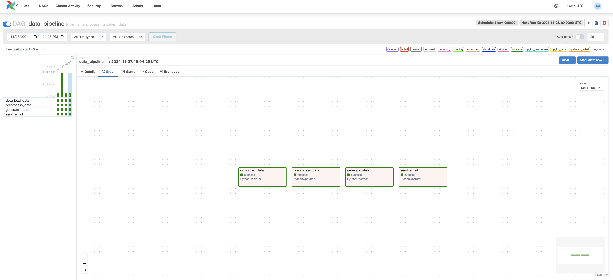
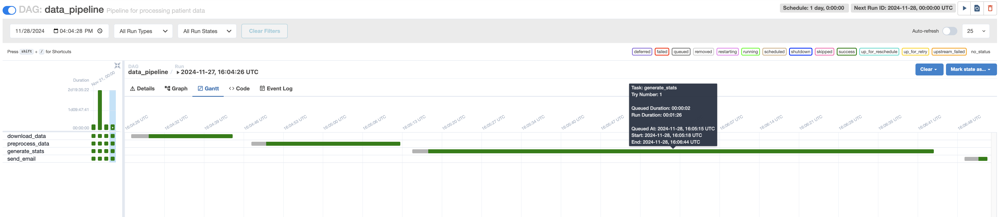
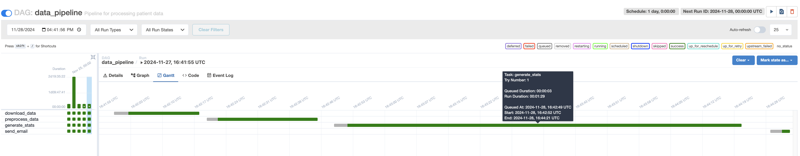
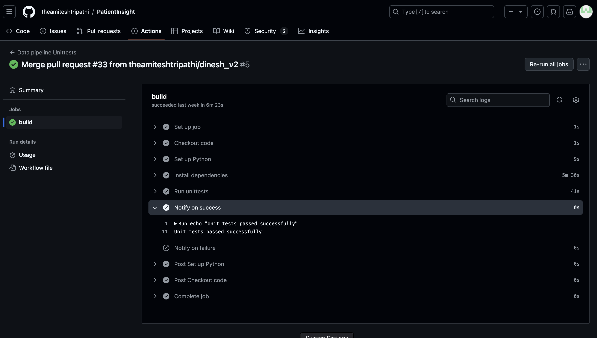
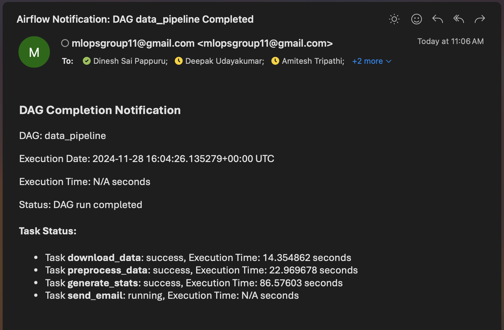

# PatientInsight - Data Pipeline

This project, **Patient Insight**, aims to build a modular and reusable data pipeline to clean, transform, and perform feature engineering on healthcare data, specifically targeting patient symptom data. The preprocessing pipeline is designed for flexibility and easy adjustment to ensure scalability.

## Folder structure
- `backend/data_pipeline`: All the information regarding data pipeline is present in this path.
- `data/`: Contains raw and processed data files.
- `sripts/`: Source code for data processing and analysis.
- `tests/`: Unit tests for the project.
- `airflow/`: Airflow DAG definitions.
- `images`: Saved images to be used for readme.

## Dataset

This tool leverages insights derived from the [PMC-Patients](https://huggingface.co/datasets/zhengyun21/PMC-Patients) dataset. The dataset includes patient summaries and relationships extracted from case reports, aiding in identifying patterns across medical reports and offering enhanced decision support for doctors.

## Pre requisites
## Setting up DAG's

Make sure airflow is installed in your system.

```bash
airflow -info
```

If not installed follow the steps to install [airflow](https://airflow.apache.org/docs/apache-airflow/stable/installation/index.html).

Once you have airflow installed properly make some config changes for the airflow to pick the dags from the project dags folder. To do that open `airflow.cfg` file and replace the dags_folder_location.

```
dags_folder = /Project_Location/PatientInsight/airflow/dags
```

Whenever we make changes to config file we should make sure to run the `airflow scheduler`.
Use the below command to update the config and run airflow.

```bash
airflow scheduler &
airflow webserver -p 8080
```

You should be seeing your DAG `data_pipeline` in the UI.



## Download data
Once you start the DAG, the first task is to download the dataset. 
The task is named `download_data`.
After the task run is completed successfully, you should be seeing the dataset in the folder `data/raw/`.

    ├──data
        ├──raw
            ├──PMC-Patients.csv

## Preprocess
In the DAG, the second task is to prepocess the dataset.
The task is named `preprocess`.
After the task run is completed successfully, you should be seeing the preprocessed dataset in the folder `data/processed/`.

    ├──data
        ├──processed
            ├──PMC-Patients_preprocessed.csv

## Stat generation
In the DAG, the third task is to generate statistic report from the pre processed file.
The task is named `generate_stats`.
After the task run is completed successfully, you should be seeing the stat report in the folder `data/processed/`.

    ├──data
        ├──processed
            ├──stat_report.html

## DAG optimization
We are using ```Gantt chart``` in DAG to see if we can optimize any of the processes.



As we cannot do much about the data download and preprocess the data, we can optimize stat generation to decrease the amount of time we have to generate stats.

This can be achieved by restricting only the data columns we need to generate stats.



As you can see from gantt chart that we are able to decrease the time elapased for generating stats.

Note: Observe the start and end time of the script run, not the whole duration.

## Testing
We are using unittest modules in python to test if datasets are downloaded and processed as per requirements.

All the test files run when there are any changes to the data pipeline code using ```Github Actions```.

The files can be found under folder `tests`.

You can run the python file to test if all the unittest are working properly.
For `test_data_download.py`

```bash
python test_data_download.py
```

for `test_data_preprocess` it's

```bash
python test_data_preprocess.py
```

and for `test_stat_generation` it's

```bash
python test_stat_generation.py
```



## Tracking and logging
All the logs are maintaned by airflow.
All the task logs are available under `AIRFLOW_HOME` location under `logs/"dagname"`.

All the print statements are available under logs, we are not using any external logging as airflow does the job for us.
In future we will use the logs folder to see all the logs.

## Anomaly detection and alerts
If there are any issues in DAG tasks, alerts are sent through email when all the task have completed successfully as well as if there are any failures.



### Setting up alerts using mail
We need make few changes in `airflow.cfg` file.
These changes are required to setup SMTP mail address.
The changes are as follows

```
[smtp]
smtp_host = smtp.your_email_provider.com  # Correct SMTP host
smtp_port = 587                            # Common port for TLS
smtp_starttls = True                       # Enable TLS (set to True if required)
smtp_ssl = False                           # Set to False if TLS is True
smtp_user = your_email@domain.com          # Your email username
smtp_password = your_password              # Your email password
smtp_mail_from = airflow@your_domain.com   # Sender email address
```

We used a new gmail account to setup mail alerts, and all the mails are directed using this email id `mlopsgroup11@gmail.com`.
