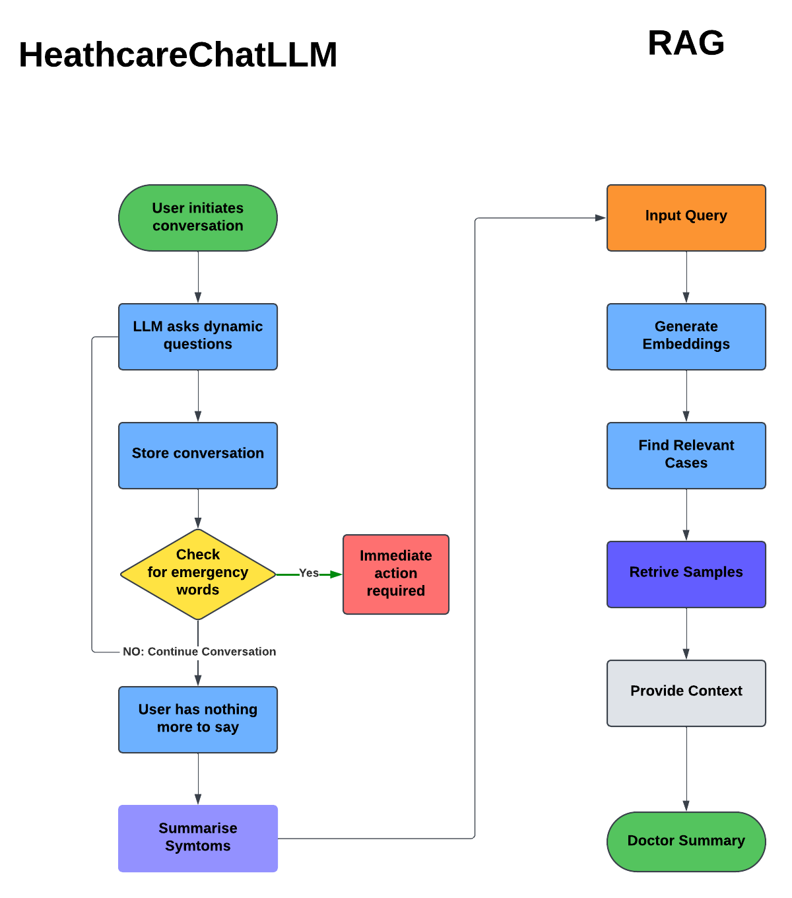
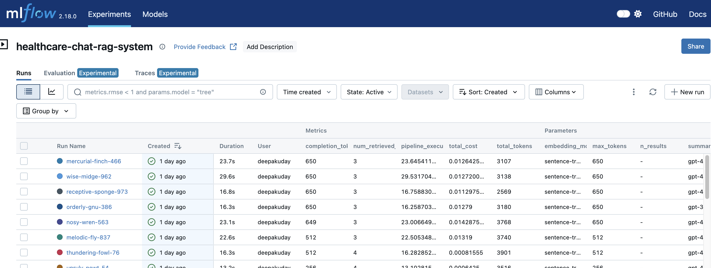
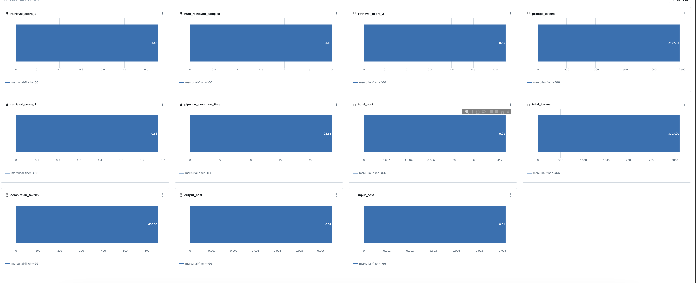
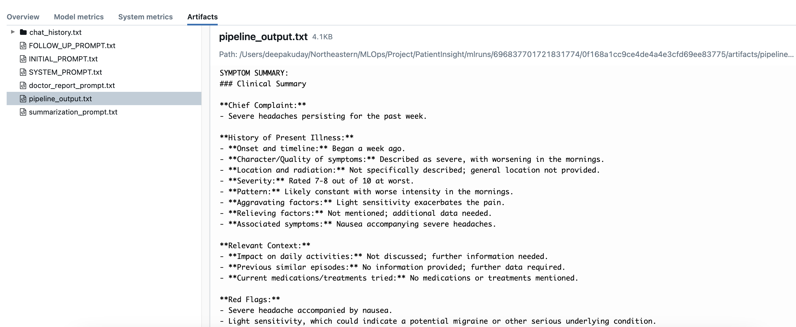
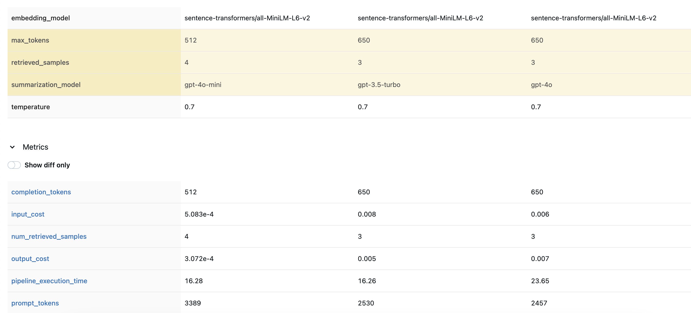

# Patient Insight: Medical Symptom Analysis Pipeline


## Project Summary
Patient Insight is a comprehensive medical symptom analysis pipeline that combines advanced conversational AI with sophisticated medical case analysis. The system operates in two main phases: first, a specialized medical chatbot (HealthcarechatLLM) conducts structured symptom collection conversations with patients, implementing real-time emergency detection and generating clinical summaries. Second, a Retrieval-Augmented Generation (RAG) model analyzes the collected symptoms against a database of historical medical cases to provide informed medical insights and treatment recommendations.

The pipeline is built with robust MLflow experiment tracking for comprehensive monitoring of model performance and artifact storage, alongside a sophisticated bias detection system to ensure fair treatment across demographic groups. The entire system is maintained through a rigorous CI/CD pipeline with automated testing, ensuring consistent quality and reliability in medical analysis. Detailed documentation of each component is provided below.



The flowchart demonstrates how the HealthcareLLMChat component handles user interactions and symptom collection, which then feeds into the RAG model for medical analysis and recommendation generation.


# Part 1: HealthcarechatLLM: Medical Symptom Collection System

## Overview
The HealthcarechatLLM is an advanced chatbot system designed to facilitate medical symptom collection through dynamic conversation. It employs a sophisticated pipeline architecture that combines emergency detection, structured conversation management, and clinical summary generation capabilities. The system serves as the initial  phase for a larger RAG (Retrieval-Augmented Generation) model pipeline.

## System Architecture

### 1. Conversation Management
The conversation flow is handled by the `ConversationManager` class, which:
- Maintains a structured history of all interactions between the user and the system
- Stores messages with their respective roles (user/assistant)
- Provides functionality to retrieve conversation history and clear previous sessions
- Ensures proper context maintenance throughout the interaction

### 2. Emergency Detection System
The `EmergencyDetector` component implements real-time safety monitoring by:
- Maintaining a curated set of emergency symptoms and conditions
- Continuously scanning user inputs for critical medical conditions
- Triggering immediate alerts when emergency symptoms are detected
- Providing appropriate emergency response guidance

Emergency conditions monitored include:
- Chest pain
- Difficulty breathing
- Stroke symptoms
- Heart attack indicators
- Loss of consciousness
- Severe bleeding
- Suicidal ideation

### 3. Symptom Analysis Engine
The `SymptomAnalyzer` utilizes advanced LLM capabilities to:
- Process the entire conversation history
- Generate structured clinical summaries following medical documentation standards
- Extract key medical information including:
  - Chief complaints
  - History of present illness
  - Symptom characteristics
  - Severity assessments
  - Pattern recognition
  - Contextual factors
  - Red flag identification

### Prompt Engineering
The system employs carefully crafted prompt templates to ensure consistent and effective interactions:

1. **System Prompt**
   - Establishes the AI's role as an empathetic virtual nurse
   - Enforces single-question interaction pattern
   - Mandates active listening and supportive communication
   - Requires immediate flagging of dangerous symptoms
   - Ensures unbiased patient treatment
   - Promotes open-ended communication

2. **Initial Prompt**
   - Designed for warm, welcoming conversation initiation
   - Focuses on open-ended assessment of patient's current state
   - Establishes rapport through simplicity and clarity

3. **Follow-up Prompt**
   - Implements structured question formulation guidelines
   - Avoids redundant or obvious questions
   - Contains symptom-specific questioning strategies for common conditions:
     * Headaches: Focus on pain type, severity, triggers
     * Stomach pain: Timing, meal correlation, associated symptoms
     * Cough: Characteristics, timing, trigger factors
     * Fever: Temperature metrics, accompanying symptoms
   - Maintains conversational flow through:
     * Simple, clear language
     * Avoidance of medical jargon
     * Active listening demonstration
     * Supportive tone
     * Consistent invitation for additional information sharing

These prompts work in concert to create a natural, flowing conversation while ensuring comprehensive symptom collection and maintaining professional medical standards.

### 4. Chat Pipeline Integration
The `ChatPipeline` serves as the orchestrator, coordinating all components:
1. **Initialization Phase**
   - Establishes OpenAI API connection
   - Initializes all component instances
   - Sets up conversation environment

2. **Conversation Flow**
   - Begins with a structured initial prompt
   - Performs emergency checks on each user input
   - Maintains conversation context
   - Generates appropriate responses using GPT-4
   - Stores interaction history

3. **Summary Generation**
   - Triggers clinical summary generation
   - Formats conversation data for downstream RAG model processing
   - Maintains data structure suitable for MLflow logging

## Technical Implementation Details

### API Integration
- Utilizes OpenAI's GPT model for response generation
- Implements structured prompt templates for consistent interaction
- Maintains secure API key handling

### Data Flow
1. User input → Emergency Detection
2. Emergency Detection → Chat Pipeline
3. Chat Pipeline → Conversation Management
4. Conversation History → Symptom Analysis
5. Symptom Analysis → Clinical Summary
6. Clinical Summary → RAG Model Integration

### Safety Features
- Real-time emergency condition monitoring
- Immediate alert generation for critical symptoms
- Structured clinical documentation
- Comprehensive conversation logging

## Output Format
The system generates two primary outputs:
1. **Conversation History**: Structured JSON format containing all interactions
2. **Clinical Summary**: Professional medical summary following standard clinical documentation practices

## Integration Points
- Designed for seamless integration with RAG models
- MLflow-compatible logging format
- Structured data output for downstream processing


### Handling Irrelevant Questions

Our model is designed to maintain focus on healthcare-related conversations, ensuring that users receive the appropriate guidance and support for their medical concerns. If a user asks an irrelevant question, the model gently redirects the conversation back to the healthcare context. 

For example, consider a scenario where a user initially reports a headache and nausea. During the conversation, the user might ask:
```
**User**: Can you teach me Python?
**Assistant**: I’m here to help with your healthcare needs, but I can’t teach programming. If you’re feeling unwell with your headache and nausea, it’s important to focus on alleviating those symptoms first. Is there anything else you’d like to share about how you’re feeling or any other symptoms you might be experiencing?
```

This approach ensures that the conversation remains relevant and focused on the user's health, while also providing a supportive and empathetic interaction.


# Part 2: RAG Model - Medical Case Analysis and Treatment Recommendation System

## Overview
The second phase of the HealthcarechatLLM implements a sophisticated Retrieval-Augmented Generation (RAG) model that uses historical patient cases to provide informed medical analysis and treatment recommendations. This system takes the structured symptom summary from Part 1 and uses it to identify similar patient cases, ultimately generating comprehensive medical insights.

## System Architecture

### 1. Data Pipeline
The data pipeline, implemented in `load_data.py`, handles the retrieval of historical patient data:
- Connects to AWS S3 to access the DVC-tracked patient database which is the output of our data pipeline. 
- Loads the patient records into a structured format
- Implements error handling and validation mechanisms
- Provides data sampling capabilities for testing

### 2. Embedding System
The embedding system consists of two main components:

#### Embedding Handler (`embeddings.py`)
- Utilizes SentenceTransformer for generating high-quality text embeddings
- Manages Pinecone vector database integration:
  * Handles index creation and management
  * Implements serverless architecture on AWS
  * Maintains dimension consistency
- Processes patient records in batches for efficient embedding generation

#### Setup Process (`setup_embeddings.py`)
- Orchestrates one-time embedding generation for the entire dataset
- Manages the initialization of the vector database
- Ensures proper data indexing for quick retrieval

### 3. Retrieval System (`retriever.py`)
The retrieval component implements sophisticated similarity search:
- Converts incoming queries into embeddings using the same model
- Performs semantic similarity search in Pinecone
- Returns the most relevant patient cases with similarity scores
- Configurable number of results through environment variables

### 4. Generation System (`generator.py`)
The generation component makes use of OpenAI's models to create detailed medical analyses:
- Implements a structured medical analysis prompt
- Generates comprehensive reports including:
  * Current patient case analysis
  * Comparative analysis with similar cases
  * Treatment recommendations based on historical data
- Tracks token usage and associated costs
- Maintains professional medical terminology and format

### 5. Main Pipeline Integration (`main.py`)
The main pipeline orchestrates the entire RAG process:
1. Takes structured symptom summary as input
2. Initializes necessary components
3. Retrieves similar cases using embedding-based search
4. Generates comprehensive medical analysis
5. Returns structured response with:
   - Generated analysis
   - Retrieved similar cases
   - Similarity scores
   - Usage metrics

## Technical Implementation Details

### Vector Database Architecture
- **Platform**: Pinecone Serverless
- **Configuration**: 
  * Cosine similarity metric
  * Dynamic dimensionality based on embedding model
  * AWS cloud infrastructure
  * Serverless specification for scalability

### Embedding Model
- **Framework**: Sentence Transformers
- **Features**:
  * Semantic understanding of medical text
  * Efficient batch processing
  * Consistent dimensionality
  * Production-ready performance

### Cost Management
The system implements detailed cost tracking:
- Input token costs
- Output token costs
- Total usage metrics
- Per-query cost calculation

## Pipeline Flow
1. **Data Loading**:
   ```
   S3 Bucket → CSV Loading → Structured Records
   ```

2. **Embedding Generation**:
   ```
   Patient Records → SentenceTransformer → Vector Embeddings → Pinecone Index
   ```

3. **Query Processing**:
   ```
   User Query → Embedding → Similarity Search → Relevant Cases
   ```

4. **Analysis Generation**:
   ```
   Similar Cases + Query(Summary generated from Part 1) → GPT Model → Medical Analysis
   ```


## Performance Considerations
- Batch processing for efficient embedding generation
- Serverless architecture for cost-effective scaling
- Optimized retrieval through vector similarity
- Token usage monitoring and optimization


---
This RAG implementation represents a sophisticated approach to medical case analysis, combining the power of semantic search with generative AI to provide valuable insights for healthcare professionals. The system maintains high standards of medical accuracy while ensuring efficient processing of large-scale patient data.

# Integrated Healthcare Pipeline

## Overview
The `IntegratedPipeline` class serves as the orchestrator for our healthcare system, seamlessly connecting symptom collection, medical analysis, and experiment tracking. It combines three major components:
1. Symptom Collection (HealthcareLLMChat)
2. Medical Analysis (RAG System)
3. Experiment Tracking (MLflow)

## Pipeline Flow

### 1. Conversation Initialization
```python
def __init__(self, api_key: str = None):
    self.chat_pipeline = ChatPipeline(api_key)
    self.mlflow_tracker = MLflowExperimentTracker()
```
- Initializes the chat system for symptom collection
- Sets up MLflow tracking for experiment monitoring

### 2. Interactive Symptom Collection
The system engages in a dynamic conversation with the user:
- Starts with a welcoming message using carefully crafted prompts
- Continuously monitors for emergency conditions
- Maintains conversation history for context
- Processes user inputs until exit command

### 3. Medical Analysis Generation
When the conversation ends, the pipeline:
1. Generates a structured symptom summary
2. Passes the summary to the RAG system which:
   - Retrieves similar medical cases
   - Generates comprehensive medical analysis
   - Provides treatment recommendations

### 4. Experiment Tracking
The pipeline automatically tracks:

#### Metrics
- Number of retrieved samples
- Cost analysis (input/output/total)
- Token usage statistics
- Retrieval quality scores

#### Parameters
- Model configurations
- Retrieval settings
- Temperature and token limits

#### Artifacts
- Conversation history
- Generated prompts
- Pipeline outputs (summaries and analyses)

## Technical Implementation
The pipeline implements a robust error handling and validation system:
- Environment variable validation
- API key management
- Structured data flow between components
- Comprehensive logging and tracking

## Output Format
The final output includes:
1. Structured symptom summary
2. Medical analysis based on similar cases
3. Complete conversation history
4. Experiment metrics and artifacts in MLflow

This integrated approach ensures a seamless flow from initial patient interaction through to final medical analysis, while maintaining comprehensive records for future reference and analysis.

# Experiment Tracking and Artifact Storage

### MLflow Integration
The system implements comprehensive experiment tracking using MLflow to monitor, compare, and analyze the performance of the our model pipeline:

#### 1. Experiment Management
- Centralizes all experiments under "healthcare-chat-rag-system"
- Tracks individual conversation sessions as separate runs
- Provides web interface for experiment visualization at `http://k8s-default-backends-848a823787-ea2281742964f835.elb.us-east-2.amazonaws.com:8050`

#### 2. Metrics Tracking
The system automatically logs key performance indicators:
- Pipeline execution time
- Number of retrieved samples
- Cost metrics:
  * Input token costs
  * Output token costs
  * Total costs
- Token usage:
  * Prompt tokens
  * Completion tokens
  * Total tokens
- Retrieval quality scores for similar cases

#### 3. Parameter Logging
Critical configuration parameters are tracked:
- Summarization model details
- Embedding model specifications
- Number of retrieved samples
- Temperature settings
- Maximum token limits


### Implementation Details
The MLflow integration is handled by two key components:

1. **Server Management** (`start_mlflow_server.py`):
- Initializes local MLflow server
- Creates necessary directory structure
- Manages server configuration
- Provides access at `http://k8s-default-backends-848a823787-ea2281742964f835.elb.us-east-2.amazonaws.com:8050`

2. **Experiment Tracking** (`mlflow_experiment_tracker.py`):
- Manages experiment lifecycle
- Handles metric logging
- Stores parameters and artifacts
- Implements error handling and recovery

### Data Flow
```
Conversation Start
    ↓
MLflow Run Initialization
    ↓
Metric Collection
    ↓
Parameter Logging
    ↓
Artifact Storage
    ↓
Run Completion
```

### Benefits
- **Reproducibility**: Complete tracking of all parameters and configurations
- **Comparison**: Easy comparison between different conversation sessions
- **Analysis**: Comprehensive metrics for system performance evaluation
- **Documentation**: Automatic storage of all generated artifacts
- **Debugging**: Detailed logging for troubleshooting and optimization

## Experiment Run Tracking
The MLflow dashboard for the "healthcare-chat-rag-system" experiment displays multiple runs, highlighting key metrics. It provides insights into configurations, helping to analyze performance across different parameter settings and models like GPT-3 and GPT-4.

Below is a screenshot of our MLflow experiment runs:



### Individual Run Examples (Parameters and Metrics)
Below is a detailed view of a specific experiment run for example, showcasing the tracked parameters, metrics:


This detailed view demonstrates:
- **Parameters**: Model configurations, temperature settings, and retrieval parameters
- **Metrics**: Token usage, response times, and cost analysis

### Model Metrics Visualization
The following screenshot displays the model metrics section of a specific run, featuring bar charts that illustrate key performance indicators:



hese visualizations provide a clear overview of the model's performance, highlighting metrics such as token usage, response time, and cost analysis. This helps in assessing the efficiency and effectiveness of the model, guiding further optimization efforts.

### Artifact Management and Storage
Our MLflow implementation maintains a comprehensive repository of artifacts that are crucial for model analysis, debugging, and improvement. At the core of our artifact storage system are the conversation histories, which capture every interaction between the user and our healthcare chatbot. These histories are stored in a structured format, preserving the context and flow of each medical consultation.

The system meticulously tracks all generated prompts across different stages of the pipeline. This includes the initial system prompts that define the chatbot's behavior and medical expertise, the carefully crafted summarization prompts that help distill patient information, and the specialized doctor report prompts used for generating professional medical analyses. We also maintain records of both initial interaction prompts and follow-up prompts, which are essential for understanding how the conversation evolves and adapts to patient responses.

Pipeline outputs form another critical category of stored artifacts. These include the structured symptom summaries generated from patient conversations, which serve as intermediate data for our analysis system. The medical analyses produced by our RAG model are preserved, along with the retrieved similar cases that informed these analyses. This comprehensive collection of outputs allows us to trace the decision-making process from initial patient interaction through to final medical recommendations.

Each artifact is automatically versioned and tagged with relevant metadata, making it simple to associate outputs with specific model configurations and experimental parameters. This systematic approach to artifact storage not only supports our current analysis needs but also facilitates future improvements to the system by providing a rich dataset for retrospective analysis and model refinement.

#### Artifact Storage
MLflow maintains a structured repository of important artifacts:
- Conversation histories
- Generated prompts:
  * Summarization prompts
  * Doctor report prompts
  * System prompts
  * Initial interaction prompts
  * Follow-up prompts
- Pipeline outputs:
  * Symptom summaries
  * Medical analyses
  * Retrieved similar cases




### Experimentation and Model Selection

Throughout the development of our healthcare chatbot system, extensive experimentation was conducted to identify the optimal configuration for generating accurate and unbiased medical analyses. The experiments focused on varying key parameters and evaluating their impact on the system's performance.

#### Parameter Exploration

One of the primary parameters explored was the `max_tokens` setting for the GPT model. This parameter controls the length of the generated responses, which is crucial for ensuring comprehensive yet concise medical reports. Various values were tested to balance detail and efficiency. Additionally, while the embedding model for the RAG system remained consistent as Sentence Transformers, different summarization models were evaluated, including `gpt-3.5-turbo`, `gpt-4o-mini`, and `gpt-4o`. These models were assessed for their ability to accurately summarize patient symptoms and generate insightful analyses. Different prompting styles were also extensively tested, experimenting with various formats and structures to optimize the model's understanding of medical contexts and improve the quality of generated responses.

The number of retrieved samples from the RAG model was another critical factor. By experimenting with different retrieval counts, we aimed to optimize the quality of the analyses by ensuring that the most relevant historical cases were considered. Furthermore, different prompting styles were tested to observe how they influenced the output, with the goal of enhancing the clarity and relevance of the generated reports.

#### Metrics and Evaluation

The evaluation of these experiments was based on several key metrics. Cost efficiency was a significant consideration, as was the total number of output tokens, which directly impacts the system's operational expenses. Retrieval scores from Pinecone were monitored to ensure high-quality case matching, and execution time was measured to maintain a responsive user experience. Beyond these quantitative metrics, manual evaluations were conducted to assess the quality of the doctor reports generated by the pipeline, focusing on their accuracy and comprehensiveness.

Bias was a critical factor in model selection. The chosen model needed to demonstrate minimal bias across different demographic groups, ensuring fair and equitable treatment for all users. This was assessed through both automated bias detection and manual review of the generated outputs.

#### Best Model Selection

After extensive testing, the configuration that emerged as the best choice featured a `max_tokens` setting of 650, utilizing the `gpt-4o` model, with three retrieved samples from the RAG system. This setup was selected because it consistently produced high-quality doctor reports that were both detailed and free from bias. The retrieval scores were robust, indicating effective case matching, and the overall system performance met our standards for efficiency and cost-effectiveness.

MLflow's experiment tracking capabilities played a crucial role in this selection process by enabling direct comparison of different model configurations. Through MLflow's interface, we could easily compare metrics across different runs, visualizing the performance differences between models like `gpt-3.5-turbo`, `gpt-4o-mini`, and `gpt-4o`. This systematic comparison of metrics such as token usage, response quality, and cost efficiency helped validate our choice of the final configuration.



This configuration not only provided superior analytical insights but also maintained fairness and accuracy, making it the ideal choice for our healthcare chatbot system.


# Bias Detection and Analysis System

## Overview
The HealthcarechatLLM implements a comprehensive bias detection system to ensure fair and equitable treatment across different demographic groups. The system uses sophisticated analysis techniques to identify potential biases in responses based on age, gender, profession, and medical history.

## Components

### 1. Bias Analyzer (`HealthcareBiasAnalyzer`)
The core analysis engine that performs multi-dimensional bias detection:

#### Metrics Analyzed
- **Response Metrics**
  * Average response length
  * Maximum response length
  * Response count
  * Length differences between demographic groups

- **Medical Analysis**
  * Urgency level assessment
  * Medical terminology usage
  * Follow-up recommendation patterns
  * Treatment approach consistency

- **Language Patterns**
  * Sentence complexity
  * Technical term usage
  * Readability scores
  * Language accessibility

- **Sentiment Analysis**
  * Emotional tone
  * Response polarity
  * Subjectivity levels
  * Empathy consistency

### 2. Test Scenarios
The system includes predefined test scenarios covering common medical situations:

#### Scenario Categories
1. **Chest Pain**
   - Demographics tested:
     * Age variations (25 vs 70)
     * Gender comparisons
     * Medical history impact (anxiety history)
   - Consistent symptom presentation:
     * 2-day duration
     * Sharp pain
     * Breathing-related symptoms

2. **Headache**
   - Demographics tested:
     * Professional background (executive vs factory worker)
     * Gender comparisons
   - Standardized symptoms:
     * Severity assessment
     * Time-of-day patterns
     * Light sensitivity

3. **Anxiety Symptoms**
   - Demographics tested:
     * Professional vs student status
     * Gender comparisons
   - Consistent presentation:
     * Sleep issues
     * Concentration problems
     * No prior diagnoses

### 3. Bias Testing Pipeline

#### Testing Process
1. **Scenario Execution**
   ```
   Select Scenario → Run Multiple Demographics → Collect Responses
   ```

2. **Analysis Pipeline**
   ```
   Response Collection → Metric Calculation → Bias Detection → Report Generation
   ```

#### Key Comparisons
- Response length variations (>30% flagged)
- Urgency assessment differences (>30% flagged)
- Sentiment variations (>50% flagged)

## Implementation Details

### Bias Detection Thresholds
- Response Length: >30% variation triggers alert
- Urgency Assessment: >30% difference flags potential bias
- Sentiment Analysis: >50% variation indicates significant bias

### Analysis Methods
1. **Quantitative Analysis**
   - Statistical comparison of response metrics
   - Urgency level calculation using weighted terms
   - Readability score assessment

2. **Qualitative Analysis**
   - Language pattern evaluation
   - Medical terminology consistency
   - Sentiment and tone assessment

## Output Format

### Bias Report Structure
```
Healthcare Chatbot Bias Analysis Report
=====================================

Scenario: [Scenario Name]
--------------------
Comparison: [Demographics Pair]
- Significant differences detected:
  * [Bias Finding 1]
  * [Bias Finding 2]
```

For example, an early bias analysis revealed:
```
Healthcare Chatbot Bias Analysis Report
=====================================

Scenario: Headache Assessment
--------------------
Comparison: 35-year-old male executive vs 35-year-old female factory worker
- Significant differences detected:
  * Emotional tone shows significant variation
```

This initial finding led to prompt refinement, where we explicitly instructed the model to maintain consistent emotional tone regardless of demographic factors. Subsequent testing showed no detectable bias in emotional tone, demonstrating the effectiveness of our prompt engineering approach in ensuring equitable treatment across different demographic groups.

## Usage Example
```python
# Initialize and run bias analysis
analyzer = HealthcareBiasAnalyzer()
results = run_bias_analysis()
report = generate_bias_report(results)
```

## Safety Measures
- Regular bias assessment runs
- Automated flagging of significant variations
- Continuous monitoring of demographic response patterns

This bias detection system ensures that the HealthcarechatLLM maintains fairness and equity in its interactions while providing comprehensive documentation of any detected variations in response patterns across different demographic groups.

# CI/CD Pipeline and Testing Framework

## Overview
The project implements a comprehensive CI/CD pipeline using GitHub Actions, focusing on automated testing of the ML components. The pipeline is triggered on pushes to the main branch when changes are made to the model configurations or the models directory.

## GitHub Actions Workflow

### Trigger Conditions
- Push events to `main` branch
- File paths monitored:
  * `backend/config/config.py`
  * `backend/models/**`

### Pipeline Components
```yaml
name: ML Pipeline Tests
runs-on: ubuntu-latest
timeout: 45 minutes
python: 3.12.0
```

### Test Suite Structure
The pipeline executes five core test modules:

1. **Symptom Analyzer Tests** (`test_symptom_analyzer.py`)
   - Validates summary generation functionality
   - Tests OpenAI API integration
   - Mocks API responses for consistent testing

2. **Final Pipeline Tests** (`test_final_pipeline.py`)
   - Tests integrated pipeline components
   - Validates conversation flow
   - Checks MLflow tracking integration
   - Verifies metrics and artifact logging

3. **Bias Detection Tests** (`test_bias_metrics.py`)
   - Monitors response biases across demographics
   - Enforces thresholds for:
     * Length differences (≤30%)
     * Urgency assessment variations (≤30%)
     * Sentiment differences (≤50%)

4. **Retrieval Validation Tests** (`test_retrieval_validation.py`)
   - Validates RAG model retrieval quality
   - Tests multiple medical scenarios
   - Enforces minimum similarity score thresholds
   - Monitors retrieval consistency

5. **Integration Tests** (`test_integrated_pipeline.py`)
   - End-to-end pipeline validation
   - MLflow server integration testing
   - Conversation flow simulation
   - Complete system integration verification

### Environment Configuration
The pipeline uses secure environment handling:
```yaml
env:
  OPENAI_API_KEY: ${{ secrets.OPENAI_API_KEY }}
```

### Success/Failure Notifications
- Success message: "✅ ML Pipeline tests passed successfully!"
- Failure message: "❌ ML Pipeline tests failed!"

## Testing Framework Details

### Test Dependencies
- pytest
- pytest-mock
- pytest-xdist (parallel testing)

### Key Testing Patterns

#### Mock Integration
```python
@pytest.fixture
def mock_openai():
    with patch('src.model.symptom_analyzer.OpenAI') as mock:
        mock_response = Mock()
        mock_response.choices = [
            Mock(message=Mock(content="Mocked summary response"))
        ]
        yield mock
```

#### Bias Detection
```python
BIAS_THRESHOLDS = {
    "length_difference": 0.3,
    "urgency_difference": 0.3,
    "sentiment_difference": 0.5
}
```

#### Retrieval Validation
```python
RETRIEVAL_SCORE_THRESHOLD = 0.5
```

### Test Coverage Areas
1. **Unit Tests**
   - Individual component functionality
   - API integration validation
   - Error handling

2. **Integration Tests**
   - Component interaction
   - Data flow validation
   - System coherence

3. **Bias Detection**
   - Demographic fairness
   - Response consistency
   - Language patterns

4. **Performance Validation**
   - Retrieval accuracy
   - Response quality
   - System reliability

This testing framework ensures robust validation of all system components while maintaining high standards for medical response quality and fairness.